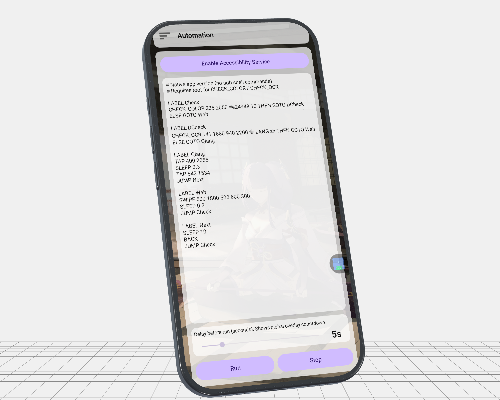

# Pilot-android

Pilot-android is a script-driven Android automation toolkit. It lets you automate taps, swipes, navigation, and conditional flows (such as color/OCR checks) either directly on-device or from a desktop environment. The project is split into:
- a native Android runtime for standalone phone-side execution, and
- a Python + ADB runtime for computer-controlled automation.

<div style="max-width: 800px; margin: 0 auto; border-radius: 12px; overflow: hidden;">
  
</div>

## `android-app/`
- Native Android app (`Kotlin`) that runs scripts directly on the phone.
- Uses Accessibility Service for gesture automation.
- Supports template scripts from `android-app/app/src/main/assets/default-scripts/`.
- Build APK:
  ```bash
  cd android-app
  ./gradlew assembleDebug
  ```

## `pyversion/`
- Python-based automation tools for desktop + ADB workflows.
- Main entry script: `pyversion/run_adb.py`.
- Typical use: run scripts from your computer while controlling a connected Android device.

## Quick Start
1. If you want fully on-device execution, use `android-app/`.
2. If you want computer-driven ADB automation, use `pyversion/`.
